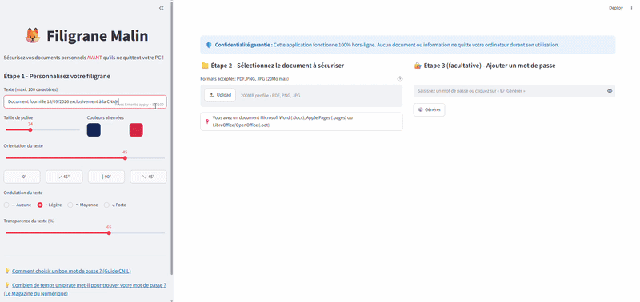

# 🦊 Filigrane Malin

[English version](#english-version)

## **L'alternative 100% hors-ligne, intelligente & sécurisée pour protéger vos documents d'identité.**

> 🐳 **NOUVEAU :** Désormais disponible en conteneur Docker ! Prêt à être déployé localement pour les utilisateurs avancés.

## 🛑 Pourquoi *Filigrane Malin* ?

**Filigrane Malin** répond au besoin de protection des données personnelles en offrant la possibilité d'apposer un filigrane et de protéger un document PDF ou une image avec un mot de passe par un processus réalisé **100% localement sur votre propre machine**. Aucune information ne quitte votre ordinateur dans le processus de création du document sécurisé, seulement lorsque **VOUS** décidez (éventuellement) de le partager après sécurisation.

Le service officiel de l'État [`filigrane.beta.gouv.fr`](https://filigrane.beta.gouv.fr/) est une excellente initiative sur le papier. Cependant, il exige des utilisateurs qu'ils envoient leurs documents les plus sensibles (cartes d'identité, passeports, fiches de paie, avis d'imposition...) sur des serveurs distants **AVANT** l'apposition du filigrane et de toute protection cryptographique éventuelle. Bien que ne contrevenant pas aux dispositions du RGPD, ce processus expose des utilisateurs vulnérables à des risques résiduels qu'ils ne comprennent pas toujours. **Il y a une différence de taille entre conformité réglementaire et sécurité maximale.**

À l'heure où les vols de données personnelles des citoyen(ne)s français(es) se multiplient dans les services publics, les associations sportives et les grandes entreprises, il faut bien comprendre que **télécharger une pièce d'identité non chiffrée et non filigranée sur un serveur tiers présente toujours un risque et expose inutilement les utilisateurs au vol de leurs données et à l'usurpation potentielle de leur identité** (qui, rappelons-le, touche plus de 200 000 personnes en France chaque année). 

* **Une promesse n'est pas un bouclier :** Le RGPD est un cadre juridique, pas un pare-feu. Il ne protège pas contre les failles "zero-day", les erreurs de configuration des serveurs, l'usurpation des accès des personnels de l'État ou l'interception de données pendant leur trajet depuis votre ordinateur vers les serveurs de l'État.

* **Une « fenêtre de vulnérabilité » résiduelle :** Même si `filigrane.beta.gouv.fr` promet une suppression instantanée du fichier téléchargé, et du fichier généré après téléchargement (ou au maximum dans les 24 heures si vous ne le téléchargez pas), votre document non sécurisé doit tout de même quitter votre ordinateur, voyager sur Internet et résider (même brièvement) sur les serveurs de l'État. Si ce serveur est compromis à ce moment précis, le script de suppression ne sert à rien : les données ont déjà été copiées.

* **Le miel & les abeilles :** Étant donné que tout le pays est invité à télécharger ses pièces d'identité et autres documents sensibles sur une unique adresse Internet, ce serveur devient une cible massive et de haute valeur (un "honeypot"🍯) pour les pirates informatiques (en espérant que ces lignes ne suscitent pas de vocations...).

**Filigrane Malin** permet une mitigation maximale de ces risques en permettant d'apposer le filigrane et une protection cryptographique (optionnelle) **100% localement** sur votre ordinateur.

## ✨ Fonctionnalités Avancées
Outre le traitement 100% local, *Filigrane Malin* inclut les éléments distinctifs suivants :
* **Déformation par onde sinusoïdale :** Le texte du filigrane suit une ligne de base ondulée, rendant l'effacement par Photoshop ou par IA générative beaucoup plus complexe et chronophage.
* **Typographie alternée & ombre portée :** Lignes de couleurs alternées avec des ombres portées pour garantir le contraste sur n'importe quel fond.
* **Filigrane paramétrable par l'utilisateur :** Outre le contenu textuel du filigrane à appliquer sur son document, l'utilisateur peut modifier la taille et les couleurs de police, l'orientation du texte ou encore l'intensité de la déformation par onde sinusoïdale.
* **Support multi-formats :** Traite les documents PDF ou les images (PNG, JPG, JPEG) et les restitue en documents PDF sécurisés sans perte de qualité.
* **Protection par mot de passe & chiffrement AES-128 :** Plus qu'un simple processeur d'images, *Filigrane Malin* est un véritable utilitaire OPSEC Zero-Trust (Sécurité Opérationnelle en mode Zéro-Confiance). Doté d'un générateur de mots de passe intégré qui utilise le module cryptographique *secrets* de Python pour créer des mots de passe robustes et à haute entropie, d'une longueur de 16 caractères, combinant majuscules, minuscules, chiffres et caractères spéciaux, il est en conformité avec les [recommandations officielles de la CNIL](https://www.cnil.fr/fr/mots-de-passe-recommandations-pour-maitriser-sa-securite) en matière de création de mots de passe sécurisés.
* **Outil pédagogique :** En éduquant l'utilisateur sur les principes de création de mots de passe *vraiment* sécurisés, et en l'encourageant à dissocier la charge utile (le document) de la clé (le mot de passe) en utilisant deux canaux de communication distincts, *Filigrane Malin* vise à vulgariser auprès du grand public les méthodes appliquées par les professionnels de la cybersécurité pour manipuler des données sensibles. Par ailleurs, si l'utilisateur souhaite créer son propre mot de passe, *Filigrane Malin* lui permet également d'en évaluer la force en affichant le temps de piratage estimé. Enfin, l'application affiche un avertissement lié à la réutilisation des mots de passe dès que l'utilisateur saisit son propre mot de passe au lieu d'utiliser le générateur intégré, et propose des liens externes vers des sites de vulgarisation en matière de création et de gestion sécurisées des mots de passe.

## 🚀 Installation

### 📌 Option no-code pour tou(te)s
Allez dans la section **[Releases](../../releases)** de ce dépôt (sur la droite de cet écran) et suivez les instructions.

### 📌 Option conteneur & code source pour les devs...
... qui n'ont pas besoin d'instructions 😉  

## 🛠️ Stack Technique
**Version de Python :** 3.13.2

**Interface utilisateur :** Streamlit

**Traitement d'image :** Pillow

**Traitement PDF :** PyMuPDF

**Génération des mots de passe :** Secrets

***Mentions légales :***  
 *Filigrane Malin est un outil fourni 'tel quel', sans garantie d'aucune sorte, explicite ou implicite. L'utilisateur reste seul responsable de l'utilisation de ses documents et du respect des exigences des organismes destinataires. Veuillez vous référer au fichier LICENSE.txt pour plus d'informations.*
 
*Vibe-codé avec Google Gemini & 💙🤍❤️ pour la protection de la vie privée des Français(es).*  

---

# 🦊 Filigrane Malin

## **The 100% offline, smart & secure alternative to protect your identity documents.**

🐳 NEW: Now available as a Docker container! Ready for zero-trust local deployment.

## 🛑 Why *Filigrane Malin*?

**Filigrane Malin** addresses the need for personal data protection by offering the ability to watermark and protect a PDF document or an image with a password through a process executed **100% locally on your own machine**. No information leaves your computer during the secure document creation process, only when **YOU** decide to (potentially) share it after securing it.

The official government service [`filigrane.beta.gouv.fr`](https://filigrane.beta.gouv.fr/) is an excellent initiative on paper. However, it requires users to upload their most sensitive documents (ID cards, passports, pay slips, tax notices...) to remote servers **BEFORE** applying the watermark and any potential cryptographic protection. While this does not violate GDPR provisions, this process exposes vulnerable users to residual risks they do not always understand. **There is a major difference between regulatory compliance and maximum security.**

At a time when personal data thefts affecting French citizens are multiplying across public services, sports associations, and large corporations, it must be understood that **uploading an unencrypted and unwatermarked identity document to a third-party server always presents a risk and unnecessarily exposes users to data theft and potential identity fraud** (which, as a reminder, affects over 200,000 people in France every year).

* **A promise is not a shield:** GDPR is a legal framework, not a firewall. It does not protect against zero-day vulnerabilities, server misconfigurations, unauthorized access by state personnel, or data interception while in transit from your computer to government servers.
* **A residual "window of vulnerability":** Even if `filigrane.beta.gouv.fr` promises instant deletion of the uploaded file and the generated file after download (or within a maximum of 24 hours if you don't download it), your unsecured document must still leave your computer, travel across the Internet, and reside (even briefly) on government servers. If that server is compromised at that exact moment, the deletion script is useless: the data has already been copied.
* **The honey & the bees:** Given that the entire country is invited to upload their ID cards and other sensitive documents to a single Internet address, this server becomes a massive, high-value target (a "honeypot"🍯) for hackers (hoping these lines don't inspire any vocations...).

**Filigrane Malin** allows for maximum mitigation of these risks by allowing you to apply the watermark and cryptographic protection (optional) **100% locally** on your computer.

## ✨ Advanced Features

Besides the 100% local processing, *Filigrane Malin* includes the following distinctive elements:

* **Sine-wave distortion:** The watermark text follows a wavy baseline, making removal via Photoshop or generative AI much more complex and time-consuming.
* **Alternating typography & drop shadow:** Alternating colored lines with drop shadows to ensure contrast on any background.
* **User-customizable watermark:** In addition to the textual content of the watermark applied to the document, the user can modify font size and colors, text orientation, and the intensity of the sine-wave distortion.
* **Multi-format support:** Processes PDF documents or images (PNG, JPG, JPEG) and outputs them as secured PDF documents without quality loss.
* **Password protection & AES-128 encryption:** More than just an image processor, *Filigrane Malin* is a true OPSEC Zero-Trust utility (Operational Security in Zero-Trust mode). Equipped with a built-in password generator that uses Python's *secrets* cryptographic module to create robust, high-entropy passwords of 16 characters combining uppercase, lowercase, numbers, and special characters, it complies with the [official CNIL recommendations](https://www.cnil.fr/fr/mots-de-passe-recommandations-pour-maitriser-sa-securite) for secure password creation.
* **Educational tool:** By educating the user on the principles of creating *truly* secure passwords, and encouraging them to separate the payload (the document) from the key (the password) using two distinct communication channels, *Filigrane Malin* aims to popularize the methods applied by cybersecurity professionals to handle sensitive data for the general public. Furthermore, if the user wishes to create their own password, *Filigrane Malin* also allows them to evaluate its strength by displaying the estimated cracking time. Finally, the application displays a warning regarding password reuse as soon as the user enters their own password instead of using the built-in generator, and provides external links to educational sites on secure password creation and management.

## 🚀 Installation

### 📌 No-code option for everyone

Go to the **[Releases](https://www.google.com/search?q=../../releases)** section of this repository (on the right side of this screen) and follow the instructions.

### 📌 Container & Source code option for devs...

... who don't need instructions 😉

## 🛠️ Tech Stack

**Python Version:** 3.13.2

**User Interface:** Streamlit

**Image Processing:** Pillow

**PDF Processing:** PyMuPDF

**Password Generation:** Secrets

***Legal Disclaimer:***

*Filigrane Malin is an tool provided 'as is', without warranty of any kind, express or implied. The user remains solely responsible for the use of their documents and compliance with the requirements of the receiving organizations. Please refer to the LICENSE.txt file for more information.*

*Vibe-coded with Google Gemini & 💙🤍❤️ for the privacy protection of French citizens.*